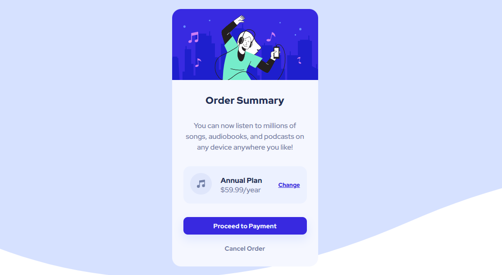

# Frontend Mentor - Order summary card solution

This is a solution to the [Order summary card challenge on Frontend Mentor](https://www.frontendmentor.io/challenges/order-summary-component-QlPmajDUj).

-24 March 2022

## Table of contents

- [Overview](#overview)
  - [The challenge](#the-challenge)
  - [Screenshot](#screenshot)
  - [Links](#links)
- [My process](#my-process)
  - [Built with](#built-with)
- [Author](#author)

## Overview

### The challenge

Users should be able to:

- See hover states for interactive elements

### Screenshot

### Links

<!-- - Solution URL: [Solution](https://your-solution-url.com) -->
- Live Site URL: [Live](https://ethenpage.github.io/order-summary-component-main/)

## My process

### Built with

- Semantic HTML5 markup
- CSS custom properties
- Flexbox

## Author

- Name - Mirza Monirul Alam
- Frontend Mentor - [@EthenPage](https://www.frontendmentor.io/profile/EthenPage)

## Date

- 25 March 2022